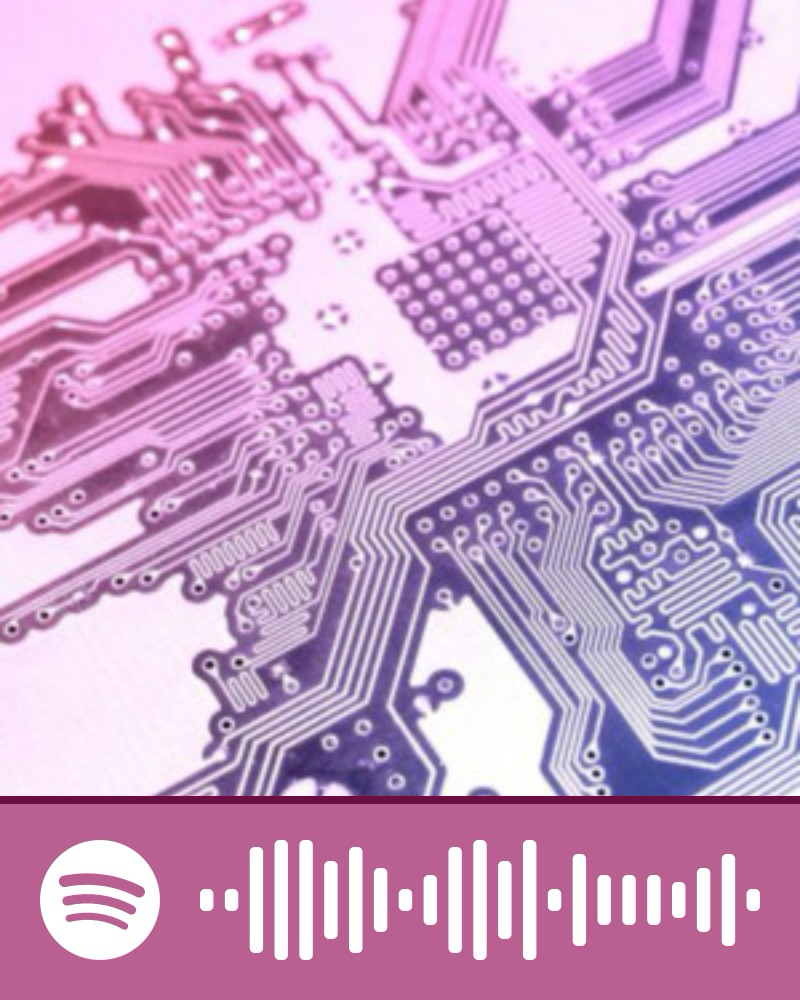

# ☆ kymadogg ☆
Robotics Engineer | Digital Artist | Hobbyist PCB Designer | Power Wheels Modder | Grad Student @ WPI
### My Favorites:

  
  
  
  
   
  
  
    

### Have Experience Using:

         
  
    
            
  
   
         
  
  
    
  
  
   
  
     

#### ☆ sounds i code to ☆

<!---
kmhswimgirl/kmhswimgirl is a ✨ special ✨ repository because its `README.md` (this file) appears on your GitHub profile.
You can click the Preview link to take a look at your changes.
--->
